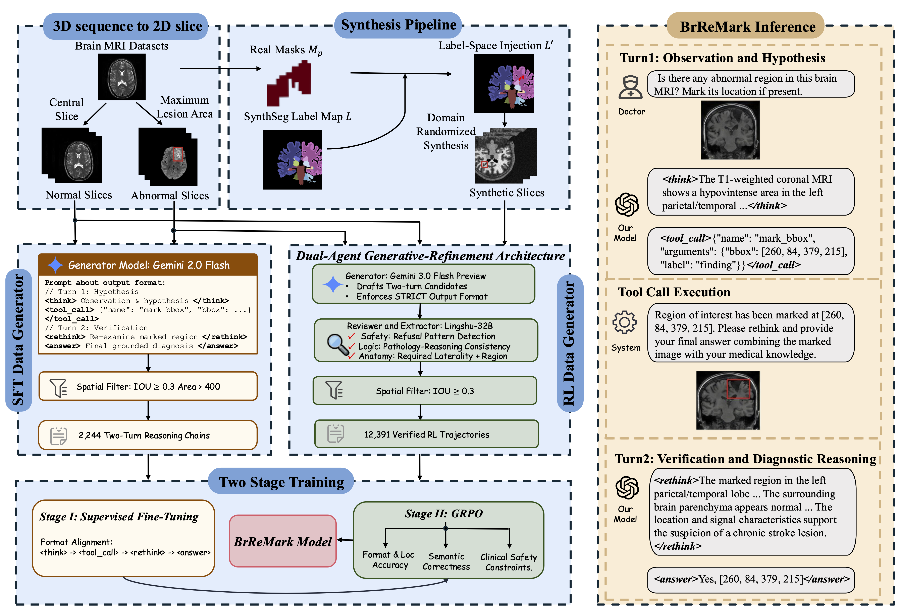

# Enhancing Brain MRI Anomaly Detection and Reasoning with ROI Rethink and Synthetic Data

[](TODO)
[](TODO)
[](TODO)

**BrReMark** (**Br**ain **Re**think via ROI **Mark**ing) is a two-turn visual reasoning framework that trains Vision-Language Models to perform grounded brain MRI anomaly detection and diagnosis through a hypothesis-mark-verification cognitive chain.

<p align="center">
  
</p>

## ⚙️ Installation

```bash
bash scripts/setup.sh
```

This script will:
- Create conda environment `brremark`
- Install necessary dependencies
- Configure the VeRL training framework

## 💡 Reasoning Format

BrReMark follows a structured two-turn reasoning trajectory:

```
[Clinician Query]: "Assess this brain MRI for any suspected anomalies."

<think>
Observing the axial FLAIR image, I notice a hyperintense region in the right temporal lobe...
</think>
<tool_call>
{"name": "mark_bbox", "arguments": {"bbox_2d": [180, 120, 310, 250], "label": "findings"}}
</tool_call>

[Environment returns marked image]

<rethink>
With the ROI marked, I can confirm irregular margins and perilesional edema...
</rethink>
<answer>
Yes. [180, 120, 310, 250]...
</answer>
```

## 🚀 Training

### Stage 1: Supervised Fine-Tuning

```bash
bash scripts/train_sft.sh
```

Trains Lingshu-7B on curated two-turn reasoning trajectories.

### Stage 2: GRPO Reinforcement Learning

```bash
# Full pipeline (real + synthetic)
bash scripts/train_rl.sh 
# Real data only
bash scripts/train_rl.sh --phase 1
# Synthetic data continuation
bash scripts/train_rl.sh --phase 2
```

Phase 1 trains with composite reward (format compliance + IoU localization + LLM-as-judge) on real clinical data. 

Phase 2 continues on SynthSeg-generated data with the LLM-judge component masked to avoid clinical hallucinations.

### Checkpoint Merging

```bash
python scripts/model_merger.py --local_dir <CHECKPOINT_PATH>
```

Merges FSDP-sharded checkpoints into HuggingFace format for inference.

## 🎯 Inference

Two-turn inference via vLLM. See [inference/README.md](inference/README.md) for details.

```bash
bash inference/start_server.sh <model_path>
python inference/inference.py --image <brain_mri.png> --task <task_name>
```

## 📊 Evaluation

LLM-as-judge evaluation for image description and diagnosis (multi-dimensional 0-10 scoring). See [eval/README.md](eval/README.md) for details.

```bash
python eval/run_judge.py --task task3 --input results.json --output judge_results.json
```

## 🏗️ Project Structure

```
BrReMark/
├── verl/                              # VeRL framework (with BrReMark customizations)
│   ├── trainer/
│   │   ├── main_ppo.py               # GRPO training entry point
│   │   ├── fsdp_sft_trainer.py       # SFT training entry point
│   │   └── config/
│   │       ├── sft_brremark.yaml      # SFT config
│   │       └── rl_brremark.yaml       # RL config
│   ├── workers/agent/envs/mark_bbox/  # Two-turn RL environment (mark_bbox tool)
│   └── utils/reward_score/
│       ├── brain_mri_diagnosis.py     # Main reward (format + IoU + LLM-judge)
│       └── synthetic_brain_mri.py     # Synthetic reward (format + IoU only)
├── scripts/
│   ├── setup.sh                       # One-click environment setup
│   ├── train_sft.sh                   # Stage 1: SFT
│   ├── train_rl.sh                    # Stage 2: GRPO (real + synthetic)
│   └── model_merger.py                # FSDP → HuggingFace conversion
├── inference/
│   ├── inference.py                   # Two-turn vLLM inference
│   └── start_server.sh               # Start vLLM server
├── eval/
│   ├── prompts.py                     # LLM-as-judge evaluation prompts
│   └── run_judge.py                   # Run judge evaluation
├── docs/
│   └── DATA.md                        # Data sources, schema, preprocessing
├── assets/                            # Figures for README
├── requirements.txt                   # Pinned dependencies
└── README.md
```

## 📂 Data

Training data is not distributed due to licensing. We use 3,696 cases from 7 public brain MRI datasets ([BraTS](https://www.synapse.org/Synapse:syn51156910/wiki/621282), [ATLAS](https://fcon_1000.projects.nitrc.org/indi/retro/atlas.html), [UPENN-GBM](https://www.cancerimagingarchive.net/collection/upenn-gbm/), [ISLES](https://isles22.grand-challenge.org/), [IXI](https://brain-development.org/ixi-dataset/)). See [docs/DATA.md](docs/DATA.md) for details.

## 📚 Citation

If you find this work useful, please consider citing:

```bibtex
@inproceedings{brremark2026,
  title={Enhancing Brain MRI Anomaly Detection and Reasoning with ROI Rethink and Synthetic Data},
  author={TODO},
  booktitle={MICCAI},
  year={2026}
}
```

## 📄 License

This project is released under [Apache 2.0 License](LICENSE).

## 🙏 Acknowledgements

We would like to thank the following repos for their great work:

- This work is built upon [VeRL](https://github.com/volcengine/verl) and [ViTAR](https://github.com/JLINEkai/ViTAR).
- This work utilizes models from [Lingshu](https://huggingface.co/lingshu-medical-mllm/Lingshu-7B).
- Synthetic data generation is based on [SynthSeg](https://github.com/BBillot/SynthSeg).
